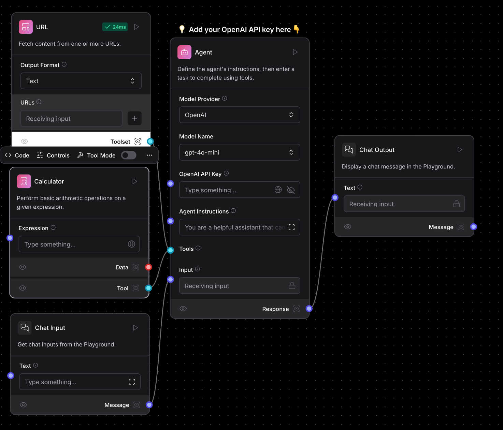

# Les Vacanciers

## Overview
The goal of this project is to develop a chatbot dedicated to planning tourist visits.

## Due Date
**01/02/2025**

## Procedure
1. Clone the main branch.
2. Create a new branch named after the associated Jira ticket.

## Technologies Used
The following technologies will be employed in this project:
1. **LLAMA**
2. **LANGCHAIN**
3. **STREAMLIT**

## Features to Implement
1. **User Interface (UI)**
2. **Large Language Models (LLMs)**

## Useful Resource
For a good starting point, refer to this resource: [Langflow on Hugging Face](https://huggingface.co/spaces/Langflow/Langflow)

## Branch Nomenclature
ft-vac-llama-name
ft-vac-langchain-name
ft-vac-streamlit-name

## Architecture

## Methodoly
Agile with **1 week** sprints (Sunday 8pm)

## Week 1
->**DOGNON** llama
->**ELIE** langchain
->**NGUEMNIN** streamlit
